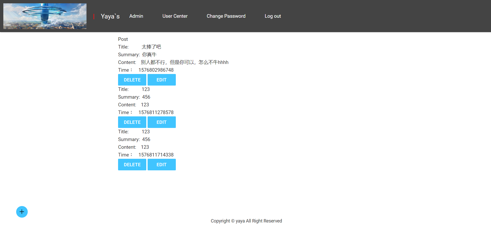

# 留言板 Guestbook

这是作业

- time: 191220
- author: dingyulong

## 技术点

Server side: 

- Node.Js
- Express framework
- MySQL Database

Browser side:

- HBS template engine
- JQuery

## Quick Start

1. Configurate your database

configuration details in `src/config.js`

sql script file in `sql/`

2. run commands as follows

```bash
npm install

npm run dev
```

3. visit `http://localhost:3000` in browser


## UI





